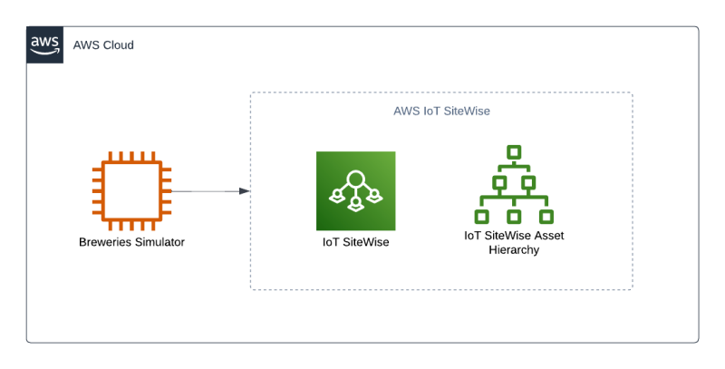
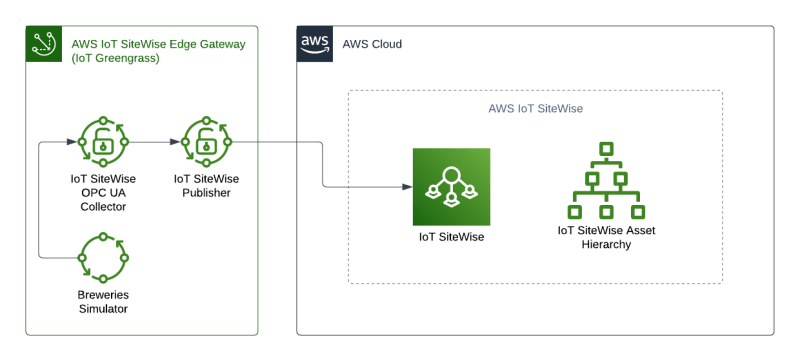

# Breweries SiteWise Simulator - Getting Started

## Summary

This repository contains a Python based simulation of a Brewery manufacturing process to exercise the capabilities of IoT SiteWise (Monitor), IoT Greengrass, IoT TwinMaker, and other IoT based AWS services that constantly runs and produces factory like data exposed via an OPC UA Server (a cross-platform, open-source, IEC62541 standard for data exchange from sensors to cloud applications developed by the OPC Foundation) for consumption by an OPC UA Client (like the IoT SiteWise OPC UA Collector). In addition, you can configure the publishing of values directly to IoT SiteWise at a specified interval. 

Feel free to run this python simulator in your own environment manually or through a quick deploy using the cloudformation templates below.

<hr>

## Simulation Description
      
This simulator program creates factory like data.  This section of the getting started guide will describe how the brewery works so you can have a better understanding of how to use and leverage the industrial data provided by the brewery. 

The diagram below is an view of the brewery material flow for the Irvine plant. The Brewery simulates production and consumption of items through the process below. This includes good production, scrap, and simulation of various utilization states. Telemetry data is also generated at the various operations for sensors like temperature, levels, and valve states. With the data produced by this simulation, metrics are calculated in the SiteWise Models for OEE (Utilization, Performance, and Quality).

> **_NOTE:_**  When deploying this simulation, it does take several minutes before equipment downstream begin to generate data as they are on hold waiting for WIP items to be available to consume.


<hr>

## 1. Quick Deploy

Quick deploy will use two cloudformation stacks. One stack will setup an EC2 instance to run the simulator and publish values directly to IoT SiteWise. The second stack will deploy models and assets to IoT SiteWise. See the architecture below:



1. Log on to your AWS Console.
2. Open this <a href="cf/sitewise-assets.json?raw=1" download>cloudformation</a> template and click "File->Save As" in your browser to download. This template deploy models and assets to IoT SiteWise.

> **_NOTE:_**  It is important that you deploy this step before the simulator as you may see a conflict with aliases already used within a datastream.
3. Go to CloudFormation in your console and click `Create Stack`.
4. Upload the template file your downloaded and proceed through the steps to deploy.

5. Wait until the stack is completed successfully. Now download and deploy this <a href="cf/simulator-server.json?raw=1" download>cloudformation</a> template from this repository to deploy the simulation server. This process will take ~10 minutes to complete.

### Clean Up

To clean up, delete the following stacks in this order:
- Simulation server
- SiteWise Assets


<hr>

## 2. Manual Install

1. Identify a system (Linux, Windows, or macOS) to host the brewery simulator Python program.

2. [Python3](https://www.python.org/downloads/)
   - Verify your python3 path and version (<b>needs to be 3.10.0+</b>). 
     ```
     python3 --version
     ```
3. Install the OPC UA Server Python Library

    - With pip:
      ```
      pip3 install opcua boto3 cryptography lxml pytz --no-input
      ```

    - Ubuntu:
      ```
      apt install python-opcua        # Library
      apt install python-opcua-tools  # Command-line tools
      ```


4. Clone this respository to your environment.
      ```
      git clone https://github.com/aws-samples/breweries-sitewise-simulator.git
      ```

5. Log in to your AWS Console
6. Open this <a href="cf/sitewise-assets.json?raw=1" download>cloudformation</a> template and click "File->Save As" in your browser to download. This template deploy models and assets to IoT SiteWise.
7. Go to CloudFormation in your console and click `Create Stack`.
8. Upload the template file your downloaded and proceed through the steps to deploy.


### 2A - Ingest Data through and OPC UA Client like AWS IoT SiteWise Edge Gateway

If you are seeking to ingest data through OPC, you can use AWS IoT SiteWise Edge gateway to ingest this data. A Greengrass component can be created to make this simualtor deployable. Feel free to do this yourself until component sample is released or run it manually on your edge device. Below is a example architecture of this integration:


6. Create an Edge Device (Ubuntu 20.04 or 18.04, Red Hat Enterprise Linux (RHEL) 8, or Amazon Linux 2) to host AWS IoT SiteWise Edge gateway.  

7. Create and deploy the AWS IoT SiteWise Edge gateway to the Edge Device, please use this URL for reference - https://docs.aws.amazon.com/iot-sitewise/latest/userguide/configure-gateway-ggv2.html. The Data processing pack is not required.

    > **_NOTE:_**  Note: When configuring the OPC UA datasource in the IoT SiteWise (or any 3rd party OPC UA Client), set the "Message security mode" to "None" and the "Authentication configuration" to "None - No authentication".  The simulator OPC UA Server program has not been tested with encryption or certificates for this current version of the program.          

8. Run the script below to start the simulation and OPC UA Server. If this were a custom Greengrass component, it would run this command for you.
```
python3 awsBrewSimServer.py --publishtositewise=False --region=us-west-2

```

### 2B - Publish values directly to AWS IoT SiteWise

9. If you would like to simply publish values directly to IoT SiteWise like the Quick Deploy example above, run the command below. It will publish values at the interval specified:
```
python3 awsBrewSimServer.py --publishtositewise=True --interval=5 --region=us-west-2

```
